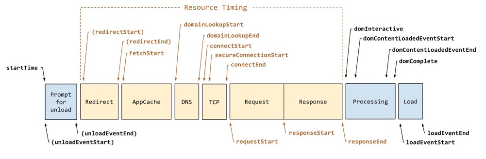

<!--
 * @Descripttion: 
 * @version: 
 * @Author: shenjia
 * @Date: 2021-01-11 14:16:35
 * @LastEditors: shenjia
 * @LastEditTime: 2021-01-11 15:35:17
-->

# 写一个前端性能监测工具

基本常识：

### 1. [navigation-timing](https://w3c.github.io/navigation-timing/)

参考：
- [写一个前端性能监测工具](https://juejin.cn/post/6844903662020460552)