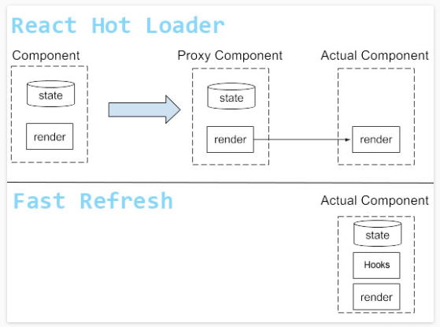

<!--
 * @Descripttion: 
 * @version: 
 * @Author: shenjia
 * @Date: 2021-01-18 11:16:46
 * @LastEditors: shenjia
 * @LastEditTime: 2021-01-18 12:11:39
-->
# React-Fast-Refresh 热更新

## 一、如何配置 React-Fast-Refresh

## 一、Fast Refresh 是什么？

为了解决 [Hot Loading](https://reactnative.dev/blog/2016/03/24/introducing-hot-reloading) 的稳定性、可靠性、容错性等问题，React Native(v16.0.1)新推出了这个特性，**React组件**修改后能立即生效。

Fast Refresh 相当于是 Live Reloading 和 Hot ReLoading 的结合。

## 二、Fast Refresh 的运行机制

### 1）Reload策略

1. 如果所编辑的模块是 React 组件，Fast Refresh 则只更新该模块的代码，并重新渲染对应的组件。此时该文件的所有修改都能生效，包括样式、渲染逻辑、事件处理、甚至一些副作用；

2. 如果所编辑的模块不只是 React 组件，Fast Refresh 将重新执行该模块以及所有依赖它的模块；

3. 如果所编辑的文件被 React（组件）树之外的模块引用了，Fast Refresh 会降级成整个刷新（Live Reloading）。

### 2）容错处理

与 Hot Reloading 相比，Fast Refresh 的容错性更强一些：

1. 语法错误：Fast Refresh 期间的语法错误会被 catch ，修改并保存文件即可恢复正常，所以存在语法错误的文件不会被执行，无需手动重刷；

2. 运行时错误：模块初始化过程中的运行时报错同样能被 catch ，不会造成实质影响，而对于组件中的运行时错误，Fast Refresh 会重刷（remount）整个应用（除非有Error Boundary）。

### 3）限制

有些情况下，维持状态并不十分安全，所以可靠起见，Fast Refresh 遇到这些情况一概不保留状态：

1. Class 组件一律重刷（remount），state 会被重置，包括高阶组件返回的 Class 组件；

2. 不纯组件模块，所编辑的模块除导出 React 组件外，还导出了其它东西；
   
3. 可以通过 `// @refresh reset` 指令（在源码文件中任意位置加上这行注释）强制重刷（remount），最大限度地保证可用性。

## 三、Fast Refresh 的实现原理

Fast Refresh 基于 HMR ，自底至上依次为：

1. HMR 机制：如 webpack HMR

2. 编译转换：react-refresh/babel

3. 补充运行时：react-refresh/runtime

4. React 支持：React DOM 16.9+，或 react-reconciler 0.21.0+

新版 React 对函数式组件、Hooks 的热替换提供了原生支持

## 四、Fast Refresh 的源码解析

## 五、比较 React-Fast-Refresh 与 React-Hot-Loader
1. React-Fast-Refresh
2. 
3. React-Hot-Loader